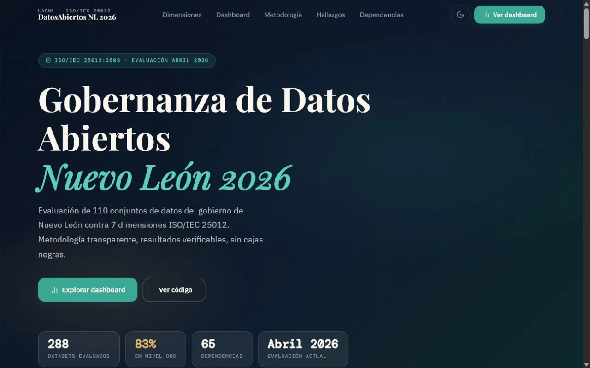

<picture>
  <source media="(prefers-color-scheme: dark)" srcset="assets/banner-dark.svg"/>
  
</picture>

# Aldo Giovanni Martínez Pineda

**Desarrollo de software · Sistemas de información · Organización del conocimiento**

Convierto información compleja en software consultable, con trazabilidad y evidencia. Estudio Gestión de la Información y Recursos Digitales en la Facultad de Filosofía y Letras de la UANL, y trabajo donde se cruzan el desarrollo, la documentación técnica y la organización del conocimiento.

## Trabajo con código público

<table>
<tr>
<td width="50%" valign="top">

**Librería Itinerante y Más** 
Sitio estático · Firebase Hosting · JavaScript

Sitio de una librería y espacio cultural de Monterrey. La superficie pública es un sitio estático con recorrido, agenda cultural y ocho rutas de lectura. El catálogo conectado e Iti IA (RAG) son un servicio interno en preparación, no una experiencia desplegada.

Código público · el despliegue operativo no se enlaza para proteger los datos de contacto del negocio.

[Código](https://github.com/Aldo14G/Itinerante)

</td>
<td width="50%" valign="top">

**DatosAbiertos NL 2026** 
Python · ISO/IEC 25012 · Firebase Hosting

Evalúa los 288 datasets del portal de datos abiertos de Nuevo León en siete dimensiones de calidad: cinco de ISO/IEC 25012 y dos de catálogo. Cobertura total del portal, con un promedio de 88.8 sobre 100 en 65 dependencias. El pipeline de extracción y puntuación está en el repositorio; la metodología y los resultados, en el sitio.

Publicado y consultable en línea.

[Código](https://github.com/Aldo14G/DatosAbiertos2026-v3) · [Sitio](https://datos-abiertos-nl-2026.web.app/)

</td>
</tr>
</table>

Otros siete proyectos no tienen repositorio público: la Biblioteca Digital y Cuerpo Humano Studio de la Escuela de Cruz Roja Mexicana en Nuevo León, el prototipo Empleo Alcanzable NL del hackathon Build with AI de GDG Monterrey, el arnés de control editorial, el pipeline de Markdown a LaTeX, el modelado del corpus lacaniano y cuatro traducciones técnicas. Cada uno tiene su expediente, con capturas y límites de acceso, en el [portafolio](https://aldo-portfolio-one.vercel.app/).

## Trayectoria

| Periodo | Puesto o programa | Institución |
|---|---|---|
| 2026 | Biblioteca Digital: catálogo del acervo con búsqueda de texto completo y filtros por facetas | Escuela de Cruz Roja Mexicana en Nuevo León |
| Agosto 2023 – actualidad | Telemarketing Web | Totalplay |
| Agosto 2021 – febrero 2022 | Auxiliar de la Biblioteca Cervantina: digitalización y catalogación de colecciones especiales de *El Quijote* | Tecnológico de Monterrey |
| En curso | Licenciatura en Gestión de la Información y Recursos Digitales | Facultad de Filosofía y Letras, UANL |
| 2021 – actualidad | Formación filosófica continua: Filosofía Griega Antigua, Filosofía Moral y Estética Filosófica | Mindshop Knowledge Society |

Formación acreditada aparte: ocho certificados de Anthropic, una ruta completa de Platzi y cuatro traducciones técnicas documentadas. Los comprobantes están en el portafolio.

## Herramientas

**Lenguajes** — Python · JavaScript · TypeScript · SQL · HTML · CSS 
**Marcos y datos** — React · Next.js · PostgreSQL · Firebase · Supabase · Pandas · Power BI 
**Práctica** — RAG · PostgreSQL FTS · ISO/IEC 25012 · LaTeX · APA 7 · Git

