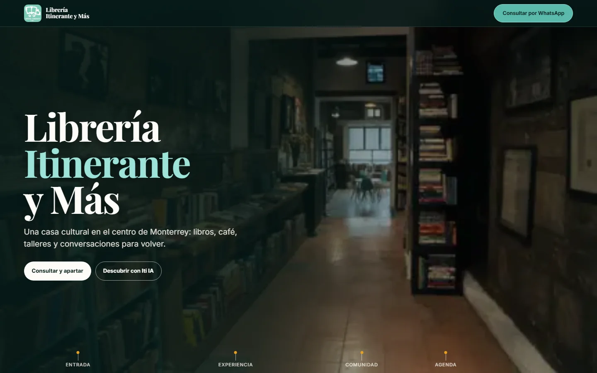
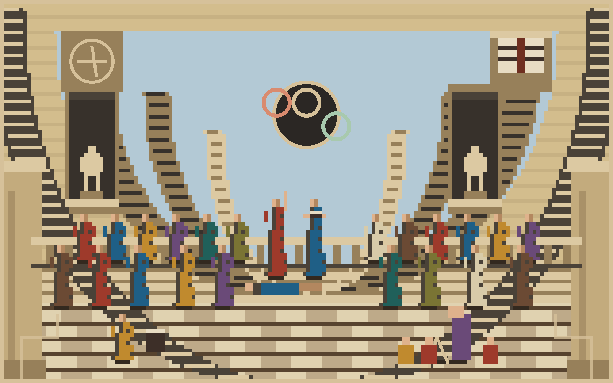

<picture>
  <source media="(prefers-color-scheme: dark)" srcset="assets/banner-dark.svg"/>
  
</picture>

# Aldo Giovanni Martínez Pineda

**Traductor técnico · Software engineer · Epistemología aplicada**

> Aldo Giovanni Martínez Pineda — convierto información compleja en software consultable, con trazabilidad y evidencia: catálogos institucionales, productos de datos abiertos y sistemas de traducción con control editorial.

  

## `PROYECTOS.EXE` — lo que construyo

### Proyecto destacado

Sitio de librería y espacio cultural en Monterrey: catálogo con búsqueda inteligente (Iti IA con RAG), agenda y visita.  [Código](https://github.com/Aldo14G/Itinerante) · [Demo](https://itinerante-e428c.web.app/)

| Proyecto | Qué es | Estado |
|---|---|---|
| [Librería Itinerante y Más](https://github.com/Aldo14G/Itinerante) | Sitio de librería y espacio cultural en Monterrey: catálogo con búsqueda inteligente (Iti IA con RAG), agenda y visita. [Demo](https://itinerante-e428c.web.app/) |  |
| [DatosAbiertos NL 2026](https://github.com/Aldo14G/DatosAbiertos2026-v3) | Datos abiertos de Nuevo León evaluados en siete dimensiones de ISO/IEC 25012, con metodología y resultados consultables.  [Demo](https://datos-abiertos-nl-2026.web.app/) |  |

## `STACK.SYS` — con lo que trabajo

## `EPISTEME.LOG` — formación

*La academia como imagen de este perfil: el conocimiento se construye en común, se verifica y se vuelve a construir — del fresco al píxel.*

- Traducciones técnicas de IA con control editorial (Vibe Coding, desarrollo guiado por especificaciones, Agent Skills, SKILL.state de Google y Purdue).
- IA generativa (Google Cloud), fluidez en IA (Anthropic), Fundamentos de Datos (Platzi).
- Epistemología (UANL) y modelado del Corpus Lacaniano.

## `EVIDENCIA.DAT` — cómo verifico

- Todo lo público aquí está referenciado en el [portafolio](https://aldo-portfolio-one.vercel.app/).
- Sin insignias sin emisor, sin métricas vanidosas, sin widgets que se rompen.
- El resto del trabajo vive en repositorios privados.

<code>CONTACTO.EXE</code> — contexto

- Facultad de Filosofía y Letras, UANL; colaborador en Mindshop Café.
- Respondo por correo o LinkedIn.

